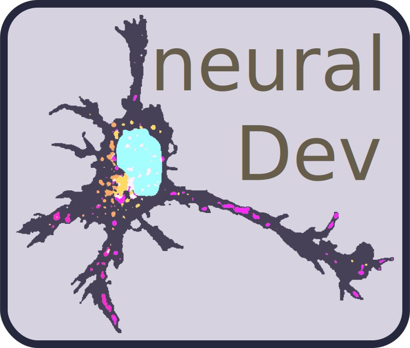

# napari-ndev

[](https://github.com/TimMonko/napari-ndev/raw/main/LICENSE)
[](https://pypi.org/project/napari-ndev)
[](https://python.org)
[](https://github.com/TimMonko/napari-ndev/actions)
[](https://codecov.io/gh/TimMonko/napari-ndev)
[](https://napari-hub.org/plugins/napari-ndev)



A collection of widgets intended to serve any person seeking to process microscopy images from start to finish. The wide breadth of this plugin's scope is only made possible by the amazing libraries and plugins from the napari community.

## Docs

[https://timmonko.github.io/napari-ndev/](https://timmonko.github.io/napari-ndev/)

----------------------------------

## Installation

**napari-ndev** is a pure Python package, and can be installed with [pip]:

```bash
pip install napari-ndev
```

The easiest way to get started with **napari-ndev** is to install all the optional dependencies (see note below) with:

```bash
pip install napari-ndev[all]
```

----------------------------------

### Optional Libraries

**napari-ndev** is most useful when interacting with some other napari plugins (e.g. napari-assistant) and can read additional filetypes (e.g. bioio-nd2). You may install these BSD-3 compatible plugins with [pip]:

```bash
pip install napari-ndev[extras]
```

**napari-ndev** can optionally use GPL-3 licensed libraries to enhance its functionality, but are not required. If you choose to install and use these optional dependencies, you must comply with the GPL-3 license terms. The main functional improvement is from `napari-bioio` to properly handle metadata with the `Image Utilities` widget, but also adds support for `czi` and `lif` files. These libraries can be installed with [pip]:

```bash
pip install napari-ndev[gpl-extras]

or

pip install napari-ndev[all]
```

In addition, you may need to install specific [`bioio` readers](https://github.com/bioio-devs/bioio) to support your specific image, such as `bioio-czi` and `bioio-lif` (included in `[gpl-extras]`) or `bioio-bioformats`.

### Development Libraries

For development use the `[dev]` optional libraries. You may also like to install `[docs]` and `[testing]` to verify your changes. However, `tox` will test any pull requests. You can also install `[dev-all]` to get all three of these dev dependencies.

----------------------------------

This [napari] plugin was generated with [Cookiecutter] using [napari]'s [cookiecutter-napari-plugin] template.

## Contributing

Contributions are very welcome. Tests can be run with [tox], please ensure
the coverage at least stays the same before you submit a pull request.

## License

Distributed under the terms of the [BSD-3] license,
"napari-ndev" is free and open source software.

Some optional libraries can be installed to add functionality to `napari-ndev`, including some that may be more restrictive than this package's BSD-3-Clause.

## Issues

If you encounter any problems, please [file an issue] along with a detailed description.

[napari]: https://github.com/napari
[Cookiecutter]: https://github.com/audreyr/cookiecutter
[BSD-3]: http://opensource.org/licenses/BSD-3-Clause
[cookiecutter-napari-plugin]: https://github.com/napari/cookiecutter-napari-plugin

[tox]: https://tox.readthedocs.io/en/latest/
[pip]: https://pypi.org/project/pip/
