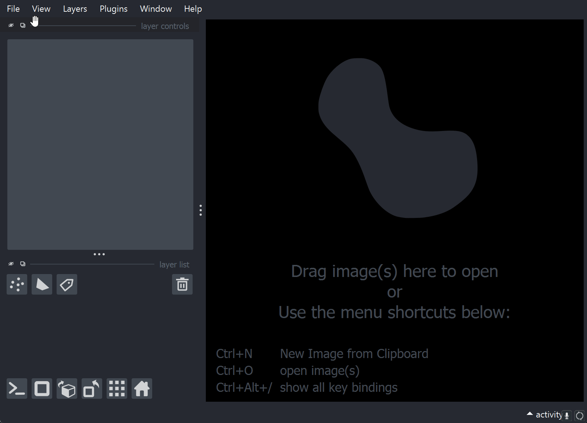
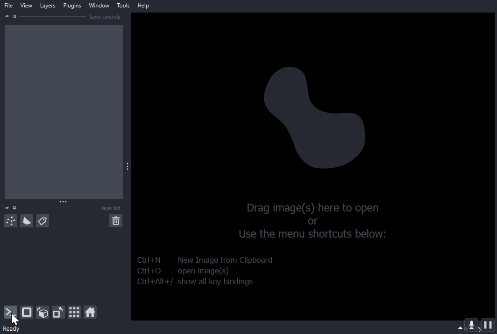

# Setup Guide to napari and napari-ndev for beginners

This guide is intended for those who do not want to work with the command line and instead get started with a more 'traditional' installation approach. Note that the napari developers do not currently recommend this approach, and you may run in to unforeseen limitations. However, napari-ndev is designed as a comprehensive package, so it should work fairly well with the napari installer.

## napari bundled installer

Download the [latest version of napari](https://github.com/napari/napari/releases/latest) found in the Assets at the bottom of the page. See the [napari bundled app page](https://napari.org/stable/tutorials/fundamentals/installation_bundle_conda.html) for detailed instructions. Currently, napari is around 500MB to install.

### opening napari

In your operating system, you can search for `napari` and open the version that you just installed. If you followed the default installation, you will also likely have a shortcut to napari on your desktop, e.g. `napari (0.5.4)`.

## napari-ndev minimal installation from UI

Inside napari, navigate to `Plugins` --> `Install/Uninstall Plugins...`. In the `filter...` text box, search for `napari-ndev`. Select `PyPI` as the Source and `Install` the most recent (default) version. This is a complete version of `napari-ndev` but lacks the full integration with other tools such as the `napari-assistant` and `napari-workflows`. This minimal installation is sufficient for full reproducibility of any analysis. For full installation see below:

### napari-ndev full installation

This method only installs python libraries that are BSD3 licensed. Some image formats (such as czi and lif) are not available unless installing the full neuralDev package. To install extra plugins go to the integrated `napari console` and enter `!pip install napari-ndev[all]`. **Note**: napari will freeze when you enter this command; please be patient as it downloads and sets up the remaining packages.

Restart napari for changes to take affect.

### bio-formats support

After the full installation, you may still be missing support for some image formats. To support all image formats you may find it useful to install bioformats support via [bioio-bioformats](https://github.com/bioio-devs/bioio-bioformats).
To install enter into the console `!pip install bioio-bioformats`. You may also need to install java, to do so: `!conda install scyjava`
