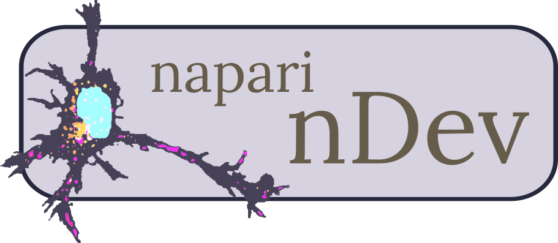

# napari-ndev (nDev)

A collection of widgets intended to serve any person seeking to process microscopy images from start to finish, *with no coding necessary*. `napari-ndev` was designed to address the **gap between the napari viewer and batch python scripting**.

* Accepts **diverse image formats**, dimensionality, file size, and maintains key metadata.
* Allows **advanced, arbitrary image processing** workflows to be used by novices.
* **User-friendly** sparse annotation and batch training of **machine learning classifiers**.
* Flexible label measurements, parsing of metadata, and summarization for **easily readable datasets**.
* Designed for ease of use, modification, and reproducibility.

----------------------------------

**Check out the [poster presented at BINA 2024](BINA_poster.md) for an overview of the plugins in action!**

**Also check out the [Virtual I2K 2024 Workshop](tutorial/00_setup.md) for an interactive tutorial to learn more!**

## Plugin Overview

1. **Image Utilities:** Intended for high-throuput image-labeling and management, while passing down important metadata. Allows opening image files and displaying in napari. Also reads metadata and allows customization prior to saving images and labels layers. Allows concatenation of image files and image layers for saving new images. Speeds up annotation by saving corresponding images and labels in designated folders. Also allows saving of shapes layers as labels in case shapes are being used as a region of interest.
2. **Workflow Widget:** Batch pre-processing/processing images using [napari-workflows].
3. **APOC Widget:** Utilizes the excellent accelerated-pixel-and-object-classification ([apoc]) in a similar fashion to [napari-apoc], but intended for batch training and prediction with a napari widget instead of scripting.
    * **Custom Feature Set Widget:** Generate a featureset to be used with the APOC widget. Also allows quick application in the napari viewer to an image layer to see all the features.
4. **Measure Widget:** Batch measurement of a label with optional corresponding image, label, and regions (ROIs) that can be used as an intensity image. Currently passed to `scikit-image.measure.regionprops`.

*The wide breadth of this plugin's scope is only made possible by the amazing libraries and plugins from the python and napari community, especially [Robert Haase](https://github.com/haesleinhuepf).*

[napari-workflows]: https://github.com/haesleinhuepf/napari-workflows
[apoc]: https://github.com/haesleinhuepf/apoc
[napari-apoc]: https://github.com/haesleinhuepf/napari-accelerated-pixel-and-object-classification
