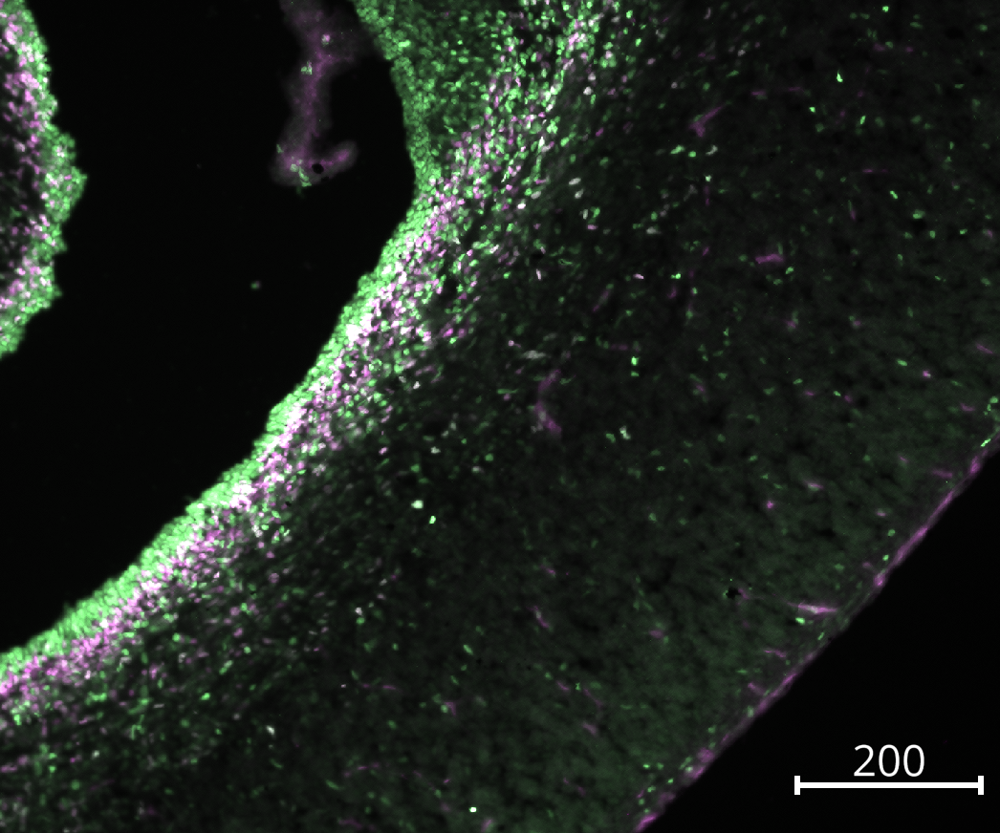

# Setup for Tutorial

## Installation of napari and napari-ndev

You have two options to download `napari` and `napari-ndev`. For users unfamiliar with using the command line and python, I would recommend following the instructions to install from UI at [Beginner Setup](../beginner_setup.md).

If you are familiar with python, then I would recommend creating a new environment and to do a fresh installation with `napari-ndev[all]`. Further details available in [Installation](../installation.md).

## Download Tutorial Images and Files

[[Download Link to be Inserted]]

### CellPainting Images

The images come from the [Broad Bioimage Benchmark Collection](https://bbbc.broadinstitute.org/BBBC022/). Investigate the link for the description of the images.

Scale: 0.656um/pixel

### Channels

1. Hoescht 33342 (nuclei)
2. con A (endoplasmic reticulum)
3. SYTO 14 (nucleic acids: nucleoli, cytoplasmic RNA)
4. WGA + phalloidin (plasma membrane, golgi, and actin)
5. MitoTracker Deep Red (mitochondria)

## NeuralProgenitor Images

These images come from the Zhe Chen lab at the University of Minnesota. These come from a microscope that *very poorly* saves the images: the images are forced to be saved as RGB (dspite having only one channel in each image) and improper scaling metadata. The images available in this tutorial have already been concatenated and the metadata applied using the `Image Utilities`.

Pax6 - Green; Tbr2 - Magenta

Scale: 0.7548um/pixel

### Channels:

1. PAX6 (a nuclear transcription factor identifying radial glia)
2. PAX6-2 (a duplicate of PAX6, due to the way the microscope saves images)
3. TBR2 (a nuclear transcription factor identifying intermediate progenitor cells)

