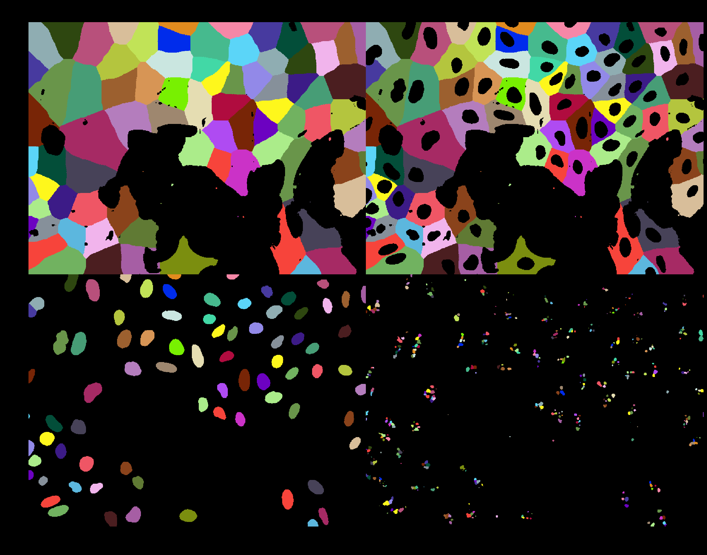
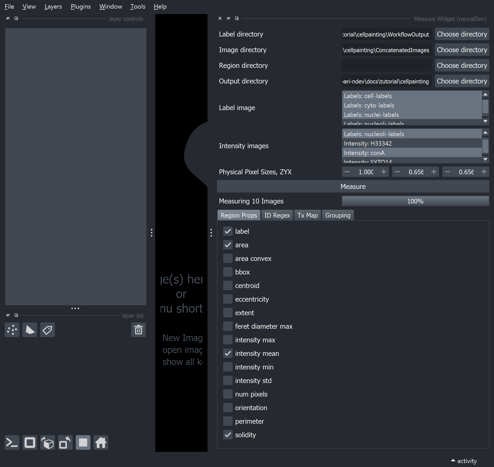
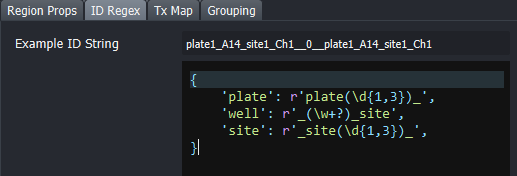
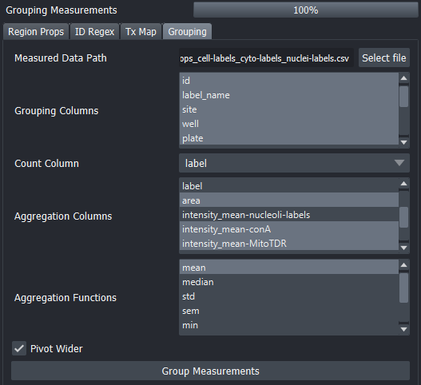

# Example Pipeline Tutorial

The goal of this example pipeline is to get the user familiar with working with `napari-ndev` for batch processing and reproducibility (view `Image Utilities` and `Workflow Widget`). In addition, this example pipeline thoroughly explains the `Measure Widget`, since this is a shared use across many pipelines.

This Example Pipeline does not cover how `napari-ndev` is used for high-throughput annotations, the machine learning tools (`APOC Widget`), and designing your own workflows. This information will iinstead be covered in the interactive [Basic Usage Tutorial](02_basic_usage.md).

## Image Utilities

We are going to start with the `Image Utilities` widget in order to concatenate the [CellPainting images](00_setup.md#cellpainting-images). This will show a common use of the Image Utilities plugin, wherein various file formats can be managed and saved in to a common OME-TIFF format, including channel names and physical pixel scaling.


1. `Choose Directory` selects where images will be saved.
2. `Select files` individual or multiple files can be selected. Select the first 5 images (representing the 5 channels of 1 image).
3. `Metadata` dropdown. We will add in names to save the channels with, according to information that is useful. This could be the fluorophore (e.g. Hoescht 33342) or other identifying information (e.g. nuclei).

    1. `Channel Name(s)`: copy and paste `['H33342', 'conA', 'SYTO14', 'WGA_Phall', 'MitoTDR']`. The format you want to use is a list `[]` of strings `'a','b','etc.'`
    2. `Scale, ZYX`. Set Y and X to `0.656`. Z will be ignored since images are 2D.

4. `Batch Concat.` Pressing this button will iterate through all files in the folder, selecting them in groups of 5 (i.e. the number of original files selected) and then saving them with the above parameters.

### Investigate the images


If you want to investigate the raw images press `Open File(s)` this will open the original images with their known scale `(1,1,1)`. Each image will open as grayscale, and will not be layered.

Now, investigate your concatenated images. Go to `Select Files` and find the folder `ConcatenatedImages` inside the `Choose Directory` previously chosen. Select the first image and `Open File(s)`. This time, the images will be open to the scale we set `(0,0.656,0.656)` and with a default layering and pseudo-coloring. This is how all images get passed down throughout the plugin.

## Example workflow

Once images are in a format that is helpful for analysis, we can proceed with other widgets. This does mean that some images do not need to be processed with the `Image Utilities` Widget; for example, some microscopes properly incorporate scale and channel names into the image metadata. For this tutorial, we are going to use the `Workflow Widget` to pre-process, segment, and label features of the image with a pre-made custom workflow file (see `cellpainting\scripting_workflow.ipynb` to see how). The intent of the `Workflow Widget` is to *easily* reproduce This custom workflow was designed initially with the `napari-assistant` which will be explored further in the [Basic Usage](02_basic_usage.md) tutorial section.

The goal for this workflow is to segment the nucleus, cell area (based on a voronoi tessellation of the nuclei), cytoplasm (cell area - nucleus), and the nucleoli. We will later measure the properties of tehse objects using the `Measure Widget`



## Using the Workflow Widget for Batch Processing

1. `Image Directory` choose the `ConcatenatedImages` found in the previous parent folder.\
2. `Result Directory` create a folder to save the output images into.
3. `Workflow File` navigate to `scripted_cellpainting_workflow.yaml`

Now, you will now see the UI automatically update to show the `roots` (input images of the Workflow file). Furthermore, these `roots` will be populated by the channel names of the images in the chosen directory. In this workflow there are three root images required: (1) `Root 0: cyto_membrane` is `WGA_Phall`, (2) `Root 1: nuclei` is `H33342`, and (3) `Root 2: nucleoli` is `SYTO14`.


Next, switch to the `Tasks` tab. In this tab, the `leaves` or workflow tasks that sit at the terminals of task tree are automatically selected. However, we are also interested in visualizing the nuclei. So, hold control or command on your keyboard and also click `nuclei-labels` to add this task to the batch workflow. If all workflow tasks you are interested in are represented as `leaves` than you can even skip this tab!


Finally, press `Batch Workflow`. The `Image Directory` will be iterated through with the workflow. The Progress Bar will show updates and a log file will be saved to show the input parameters and progress of the batch processing, including any possible errors.

### Workflow notes

Just as we selected an additional task for the workflow, *any number* of tasks can be acquired from the workflow *and* if `Keep Original Images` is checked, these will also be saved in the resulting batch processed images. As such, the workflow widget can also be used to easily visualize intermediate steps of the Workflow to investigate how something was achieved and share that information. Below, napari is showing *every* original channel and *every* task in this workflow as a grid in napari; all of this is saved into one single file.


**Coming Soon:** the ability to use layers in the workflow as roots to do single image Workflows and adding them into napari immediately!

## Measure Widget

The `Measure Widget` provides the ability to measure images in batch, group important information, and even utilize metadata to map sample treatments and conditions. This widget is the newest addition the `napari-ndev`, in part because it has taken me a long time to conceptualize how to make image measurements accessible in batch, so I am particularly looking for usage feedback. For detailed usage instructions see the [`Measure Widget` Example](../examples/measure/measure_widget.ipynb).

### How measuring in Python generally works

It is often most helpful to represent a segmented image as 'labels'. Labels (including the `Labels Layer` in napari) have a pseudocolor scheme where each label (i.e. object) has a specific value, and that value is represented by a color. When these labels are then measured, each label object is measured independently and represented in one row. With few objects of interest in low-throughput processes, this can make sense, but, a label image with 100 objects will result in a spreadsheet with 100 rows. Accordingly, even measuring 10 images with 100 objects each leads to 1000 rows. To many scientists, these are both small object numbers and small image numbers, so you can imagine how quickly and easily datasets can be in the hundreds of thousands or millions of rows.

Furthermore, many many properties of images can be labeled, from area (which is scaled properly throughout this plugin to real units), to perimeter, to solidity, to sphericity. Thus, measuring label properties in Python *generally* requires knowledge of python to make sense of this long multi-variate data. Especially when it comes to grouping data by treatments or doing counts or other aggregating functions on any measurement of the labels.

The `Measure Widget` seeks to address the most common usability cases for high-throughput analyses by providing **human readable** outputs. Furthermore, treatment metadata mapping can easily be shared from a more advanced researcher to a novice, for reproducibility of more involved analyses.

### Initial Batch Measurement with the Widget



1. `Label Directory`: Select the directory containing the Labels you desire to measure -- in this case choose the directory from the `Workflow Widget`. This image file can contain any number of labels (or non-labels, but those should not be measured). Channels will populate both `Label Image` select and `Intensity Images`.
2. `Image Directory`: An ***Optional*** directory -- choose the `ConcatenatedImages` directory to populate the original channel images to the `Intensity Images` select box.
3. `Region Directory`: Another ***Optional*** directory intended for 'ROI'/Region of Interest labels -- not used for this pipeline.
4. `Label image`: Using multi-selection, select `cell-labels`, `cyto-labels`, and `nuclei-labels`. We will measure *each* object in each image.
5. `Intensity images`: Using multi-selection, select `nucleoli-labels` (to measure the number of nucleoli inside the label), `conA` and `mitoTDR` (to measure the underlying intensity of the channel on the label).
6. `Region Props`. This is a list of the measurements for each label. For this example, at least select `label`, `area`, `intensity_mean` and `solidity`. `label` is the identity, and is recommended to always be checked. Otherwise you can measure shape features like area, eccentricity, and solidity or you can measure intensity features like the mean, max, min, etc. Note, that measuring something like the `intensity max` of an intensity image that represents an ROI serves as a means to identify if it is inside (i.e. the value of the ROI) or outside (i.e. 0) the region.
7. At this point, you could hit the Measure button and it will measure all label channels in each image in batch. However, for this example we also want to add some identification and treatment data to the output. This example data comes from wells with no treatment, so we will generate some ourselves to explain the concept, but this should be straightforward enough to apply to your own data. To use the `ID Regex` and `Tx Map` tags we use dictionaries of key: value pairs where the key becomes the column name, and the value contains the regular expression to search for.
8. `ID Regex` tab. This dictionary extracts information from the filename with regular expression patterns. These data all come from `plate1` but if we had multiple plates we could extract the plate number with the following regex `r'(plate\d{1,2})-'` whatever is inside the `()` is considered the 'group' that gets returned. In this case we can provide the dictionary to return the identifying number of the plate and the well position. We specifically need the well position in order to map it to the treatment map. Copy and paste this into `ID Regex`

``` python
{
    'plate': r'plate(\d{1,3})_',
    'well': r'_(\w+?)_site',
    'site': r'_site(\d{1,3})_',
}
```


9. `Tx Map` tab. This dictionary maps well positions to an overall platemap. This time, the key remains the column identification, but then another dictionary is used to map the treatments inside, see below for example. The platemap is expected to be of standard configuration, but can include wells that are not imaged. First press 'Update Treatment ID Choices' to use the previous regex for Well ID. Select `well` for `Treatment ID` and `384` for `Number of Wells`. We are going to pretend the platemap has the following treatments:

``` python
{
    'media': {
        'HBSS': ['A1:C24'],
        'DMEM': ['D1:F24'],
    },
    'treatment': {
        'control': ['A12:P14'],
        'drug': ['A15:P18'],
    }
}
```



10. Press the `Measure` button! We have all the options set to richly annotate our data with identifying info and treatments... in batch!

### Grouping the data

Navigate to the `Output Directory` and find the `measure_props...csv` for your data! You can see each measure for each label, but it's hard to read interpret this way.

| label_name | id                                      | site | well | plate | label | area       | intensity_mean-nucleoli-labels | intensity_mean-conA | intensity_mean-MitoTDR | solidity          | row | column | media | treatment |
|------------|-----------------------------------------|------|------|-------|-------|------------|-------------------------------|----------------------|------------------------|-------------------|-----|--------|-------|-----------|
| cell-labels| plate1_A14_site1_Ch1__0__plate1_A14_site1_Ch1 | 1    | A14  | 1     | 1     | 1469.167104 | 0.7454598711189221            | 256.04100761570004   | 295.11511423550087     | 0.7832071576049552 | A   | 14     | HBSS  | control   |
| cell-labels| plate1_A14_site1_Ch1__0__plate1_A14_site1_Ch1 | 1    | A14  | 1     | 2     | 505.6448000000001 | 0.089361702                  | 407.0757446808511    | 389.1506382978723      | 0.9767248545303407 | A   | 14     | HBSS  | control   |
| cell-labels| plate1_A14_site1_Ch1__0__plate1_A14_site1_Ch1 | 1    | A14  | 1     | 3     | 336.092416 | 1.2586427656850192            | 233.87580025608196   | 326.2509603072983      | 0.9455205811138013 | A   | 14     | HBSS  | control   |

Instead, we want to group the data by useful metrics. Navigate to the `Grouping` tab. Select the output `measure_props...csv` for `Measured Data Path`; the selection is interpreted to fill the remaining information in the tab. If we include the `id` name in our grouping column, then it will summarize each individual image. If you then also select other identifying information, like site, well, plate, etc. then this information will be kept in the summarized file. Ultimately, data will be grouped by the most fine-grained group (in this case, each image, aka the `id`). So, if you wanted to *just* know differences between treatments you could do group only by `treatment`; **caution** this hides your raw data and just reduces the information to the aggregate function.

For this pipeline, we are going to group by: id, label_name (which label channel it is), site, well, plate, media, and treatment. This will summarize the data by `id` at the finest (each file), but preserve all that metadata. Then, we keep `Count Column` set to `label` so that it counts the number of each object in the image. Finally, we are going to aggregate other measured features. Select `Aggregation Columns`: `intensity_mean-conA` (to measure the intensity of ER) and `intensity_mean_MitoTDR` (mitochondria), and `area` (to compare the size of each object). Then observe how the there are multiple `Aggregation Functions` that by default is set to `mean`.

Next, `check` `Pivot Wider`. This will place each individual label channel in the columns, rather than replicating in rows. This is generally more human-readable and familiar for non-coding statistical work.

Finally, press `Group Measurements` button! You now have the output dataset.



### Make observations

One of the best parts of summarizing your data is quickly checking for quality control. Investigate `measure_props...grouped.csv`

1. Do we get the same number of rows that we would expect? (hint, it should be the number of images, with how we grouped)
2. Are there the same number of nuclei as cytoplasms in each image? Should there be?
3. Is the intensity of a certain marker localized more to the cytoplasm or the nucleus?
4. Is the are of the whole cell larger than the cytoplasm and nucleus alone? Does nucleus + cytoplasm = cell?

{{ read_csv(r'cellpainting/measure_props_cell-labels_cyto-labels_nuclei-labels_grouped.csv') }}
