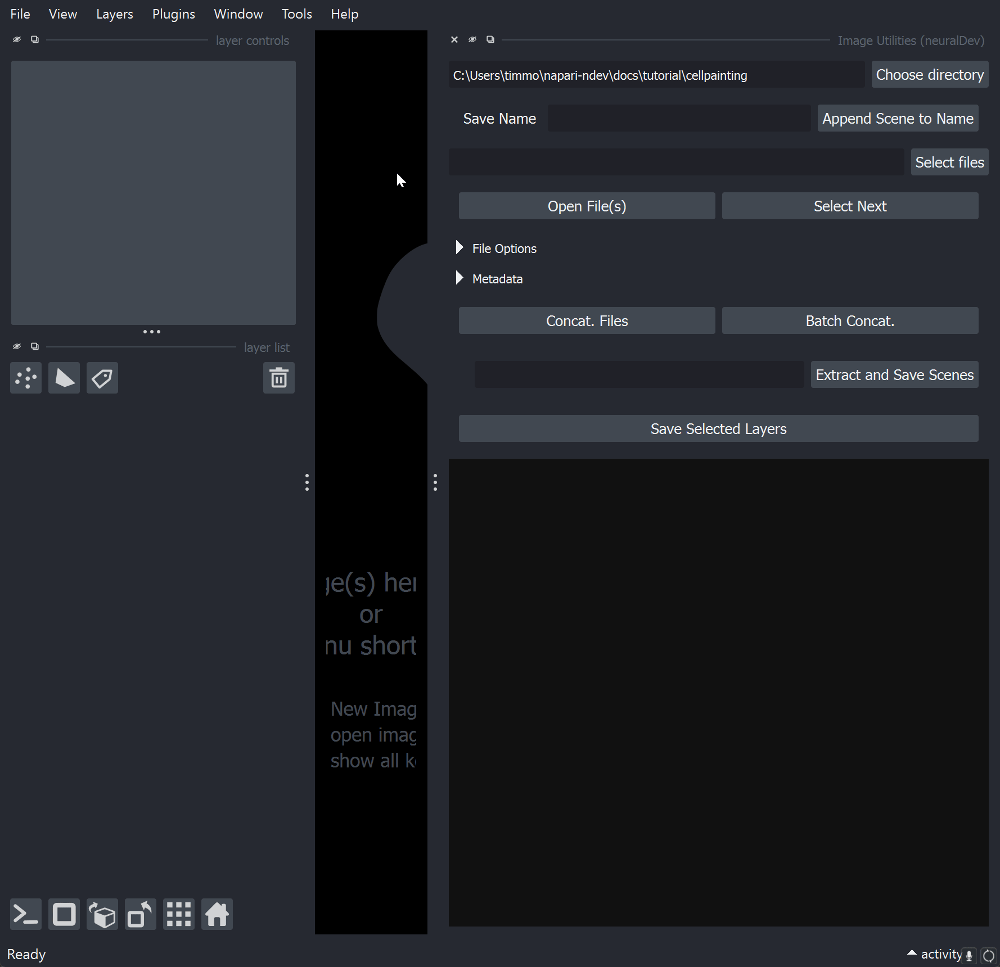
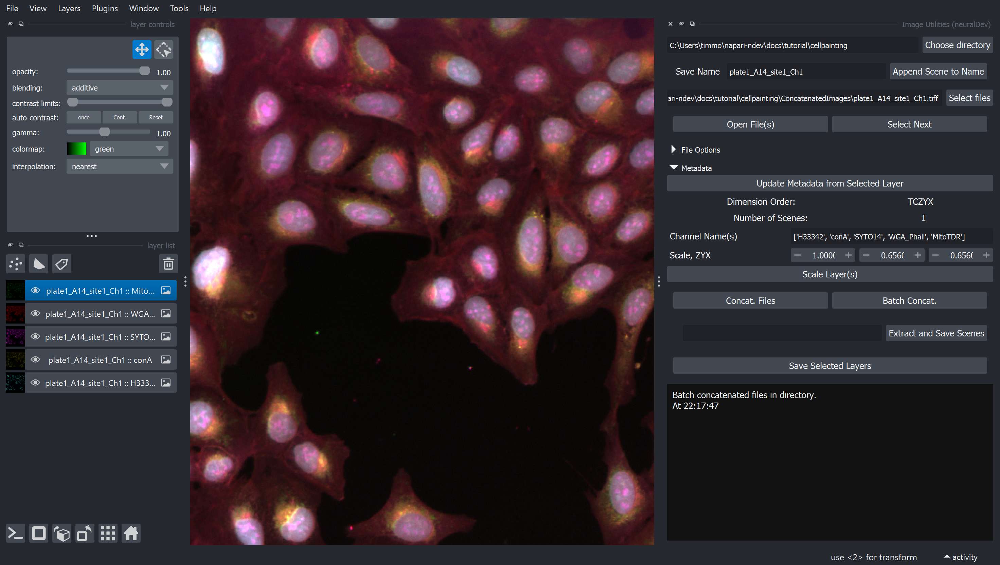
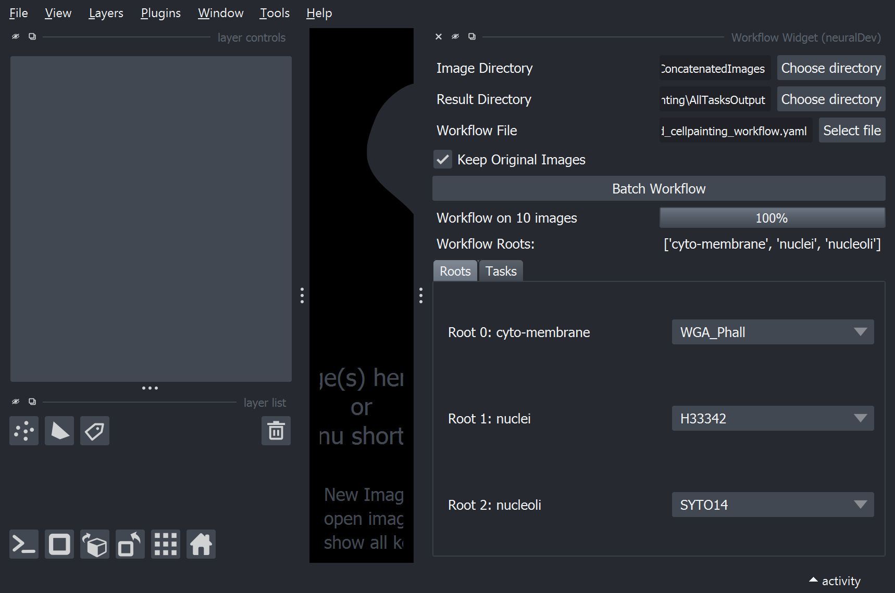
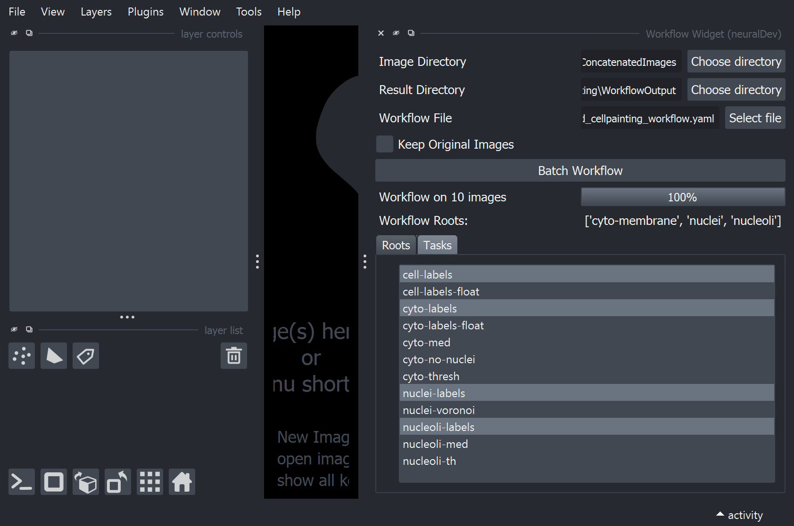
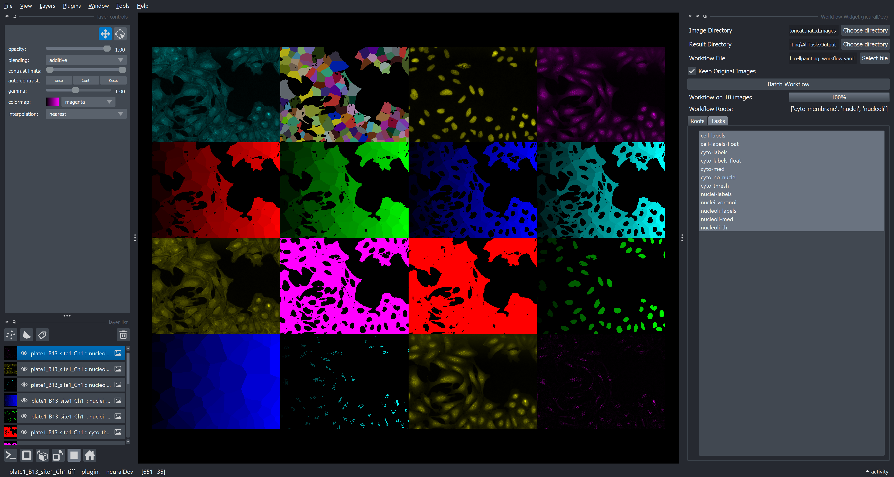

# Example Pipeline

## Image Utilities

We are going to start with the `Image Utilities` widget in order to concatenate the [CellPainting images](00_setup.md#cellpainting-images). This will show a common use of the Image Utilities plugin, wherein various file formats can be managed and saved in to a common OME-TIFF format, including channel names and physical pixel scaling.

1. `Choose Directory` selects where images will be saved.
2. `Select files` individual or multiple files can be selected. Select the first 5 images (representing the 5 channels of 1 image).
3. `Metadata` dropdown. We will add in names to save the channels with, according to information that is useful. This could be the fluorophore (e.g. Hoescht 33342) or other identifying information (e.g. nuclei).

    1. `Channel Name(s)`: copy and paste `['H33342', 'conA', 'SYTO14', 'WGA_Phall', 'MitoTDR']`. The format you want to use is a list `[]` of strings `'a','b','etc.'`
    2. `Scale, ZYX`. Set Y and X to `0.656`. Z will be ignored since images are 2D.

4. `Batch Concat.` Pressing this button will iterate through all files in the folder, selecting them in groups of 5 (i.e. the number of original files selected) and then saving them with the above parameters.

### Investigate the images

If you want to investigate the raw images press `Open File(s)` this will open the original images with their known scale `(1,1,1)`. Each image will open as grayscale, and will not be layered.

Now, investigate your concatenated images. Go to `Select Files` and find the folder `ConcatenatedImages` inside the `Choose Directory` previously chosen. Select the first image and `Open File(s)`. This time, the images will be open to the scale we set `(0,0.656,0.656)` and with a default layering and pseudo-coloring. This is how all images get passed down throughout the plugin.

## Utilize Example workflow

Once images are in a format that is helpful for analysis, we can proceed with other widgets. This does mean that some images do not need to be processed with the `Image Utilities` Widget; for example, some microscopes properly incorporate scale and channel names into the image metadata. For this tutorial, we are going to use the `Workflow Widget` to pre-process, segment, and label features of the image with a pre-made custom workflow file (see `cellpainting\scripting_workflow.ipynb` to see how). The intent of the `Workflow Widget` is to *easily* reproduce This custom workflow was designed initially with the `napari-assistant` which will be explored further in the [Basic Usage](02_basic_usage.md) tutorial section.

1. `Image Directory` choose the `ConcatenatedImages` found in the previous parent folder.\
2. `Result Directory` create a folder to save the output images into.
3. `Workflow File` navigate to `scripted_cellpainting_workflow.yaml`

Now, you will now see the UI automatically update to show the `roots` (input images of the Workflow file). Furthermore, these `roots` will be populated by the channel names of the images in the chosen directory. In this workflow there are three root images required: (1) `Root 0: cyto_membrane` is `WGA_Phall`, (2) `Root 1: nuclei` is `H33342`, and (3) `Root 2: nucleoli` is `SYTO14`.

Next, switch to the `Tasks` tab. In this tab, the `leaves` or workflow tasks that sit at the terminals of task tree are automatically selected. However, we are also interested in visualizing the nuclei. So, hold control or command on your keyboard and also click `nuclei-labels` to add this task to the batch workflow. If all workflow tasks you are interested in are represented as `leaves` than you can even skip this tab!

Finally, press `Batch Workflow`. The `Image Directory` will be iterated through with the workflow. The Progress Bar will show updates and a log file will be saved to show the input parameters and progress of the batch processing, including any possible errors.

### Workflow notes

Just as we selected an additional task for the workflow, *any number* of tasks can be acquired from the workflow *and* if `Keep Original Images` is checked, these will also be saved in the resulting batch processed images. As such, the workflow widget can also be used to easily visualize intermediate steps of the Workflow to investigate how something was achieved and share that information. Below, napari is showing *every* original channel and *every* task in this workflow as a grid in napari; all of this is saved into one single file.

**Coming Soon:** the ability to use layers in the workflow as roots to do single image Workflows and adding them into napari immediately!

## Measure Widget

The `Measure Widget` provides the ability to measure images in batch, group important information, and even utilize metadata to map sample treatments and conditions. This widget is the newest addition the `napari-ndev`, in part because it has taken me a long time to conceptualize how to make image measurements accessible in batch, so I am particularly looking for usage feedback. For detailed usage instructions see the [`Measure Widget` Example](../examples/measure/measure_widget.ipynb).

### How measuring in Python generally works

It is often most helpful to represent a segmented image as 'labels'. Labels (including the `Labels Layer` in napari) have a pseudocolor scheme where each label (i.e. object) has a specific value, and that value is represented by a color. When these labels are then measured, each label object is measured independently and represented in one row. With few objects of interest in low-throughput processes, this can make sense, but, a label image with 100 objects will result in a spreadsheet with 100 rows. Accordingly, even measuring 10 images with 100 objects each leads to 1000 rows. To many scientists, these are both small object numbers and small image numbers, so you can imagine how quickly and easily datasets can be in the hundreds of thousands or millions of rows.

Furthermore, many many properties of images can be labeled, from area (which is scaled properly throughout this plugin to real units), to perimeter, to solidity, to sphericity. Thus, measuring label properties in Python *generally* requires knowledge of python to make sense of this long multi-variate data. Especially when it comes to grouping data by treatments or doing counts or other aggregating functions on any measurement of the labels.

The `Measure Widget` seeks to address the most common usuability cases for high-throughput analyses by providing **human readable** outputs. Furthermore, treatment metadata mapping can easily be shared from a more advanced researcher to a novice, for reproducibility of more involved analyses.
