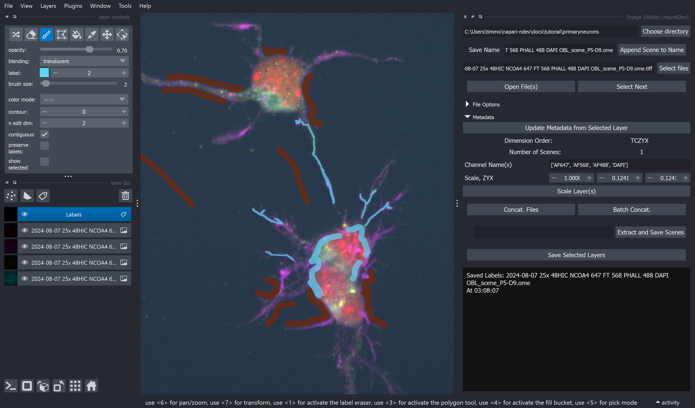
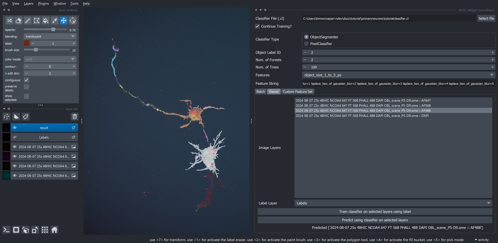
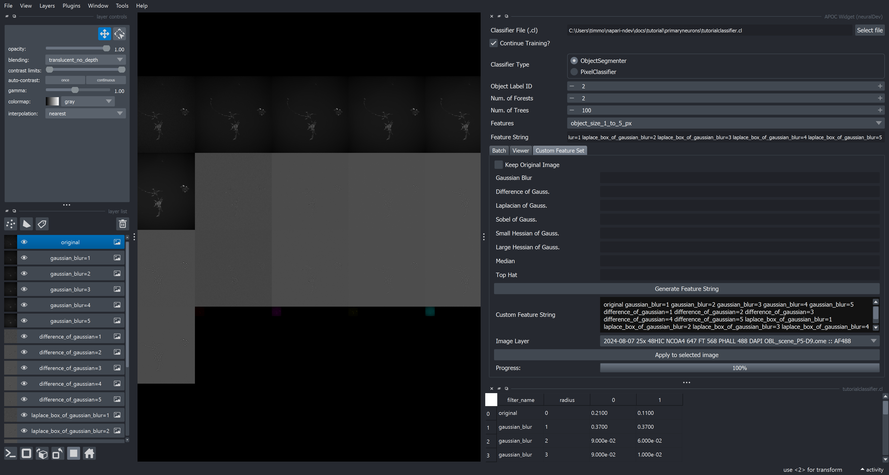

# Easy Machine Learning

The goal of this tutorial is to get a user familiar with generating annotations, workflows, and machine learning classifiers. Unlike the [Example Pipeline Tutorial](01_example_pipeline.md), this tutorial just provides raw images and hints on how to progress.

If you investigate the `primaryneurons` images you'll notice that there variable interesting morphologies that are not easy to segment by traditional intensity based segmentation. Machine Learning fills this gap (you'll see!) that Deep Learning has yet to sort out.

You might also be surprised when looking at some of the images that I would not recommend traditional intensity-based segmentation methods for NCOA4 and Ferritin (but would, and do, use it for DAPI). Instead, I would endorse using Machine Learning based segmentation because it is less sensitive to intensity (which is expected to be different between neurons and treatment group) and more sensitive to 'Features' of the images, which includes intensity, size, blobness, ridgeness, edgeness, etc.

Machine Learning classifiers are trained using [`accelerated-pixel-and-object-classifiers` (APOC)](https://github.com/haesleinhuepf/apoc) under the hood; the examples in the `apoc` repository are excellent!

The `APOC Widget` can be used to Segment Objects, Classify Pixels, and Classify Objects. Furthermore, the widget can visualize custom feature sets and be applied in the viewer or in batch.

To train Machine Learning classifiers, you need to provide some sample, sparse annotation that the classifier can evaluate as the class of pixel you are interested. A typical convention is to use label 1 for background, and subsequent labels with an increasing number. This is different from Deep Learning that requires *complete* and *accurate* annotations. In comparison, Machine Learning is much more lenient.

Overall, new Machine Learning classifiers can be evaluated within *seconds* and batch training can be accomplished in minutes... with great results!

The skills practiced in this will be used on relatively small, 2D images; however, things are intended to generally transfer to both 3D and higher dimensional datasets.

**Coming very soon** object classification (and not just segmentation) to the `APOC Widget`

## Sparse annotation with Image Utilities

One strength of `napari-ndev` is the ability to quickly annotate images and save them, while maintaining helpful metadata to pair the images up for future processing. In `napari` annotations can be made using `labels` or `shapes`. Shapes has a current weakness in that it cannot save `images`, so `napari-ndev` converts shapes to `labels` so that they match the image format. For this tutorial, we want to use the `labels` feature to 'draw' on annotations.

1. Load in one of the primary neuron images in `ExtractedScenes` using the `Image Utilities` widget.
2. Add a Labels layer by clicking the `tag` icon (the third button above the layer list)
3. Click the `Paintbrush` button in the `layer controls`.
4. Click and drag on the image to draw annotations.
5. Draw background labels with the original label (1)
6. Draw signal labels, trying to label 1-10% of the signal in the image, and with a variety of features of the target signal.
7. Press `Save selected Layers` to save the annotation for future use! It will save into a `Labels` folder in the directory.

## Generating a Machine Learning Classifier

1. Open the `APOC Widget`
2. Select a classifier file with the first button. Unfortunately, you will need to right click in your file explorer, create a new file (I usually create a .txt) and then rename it to something like `classifier.cl`. Your operarting system will prompt you that you are changing the extension of the file which could break the file, but this is ok since it is a brand new file. Select this file and hit the open button.
3. Use the default ObjectSegmenter. The number of `forests` is the number of total iterations of the classifier and the number of `trees` is the number of decisions that the Random Forest Classifier will make. These defaults are ok, but for more specific classifier, I would increase these values.
4. You can select a pre-made feature set OR do a custom feature set. ([See below](#generation-of-a-feature-set-with-apoc-widget))
5. For now, select from the `feature_set` dropdown: `object_size_1_to_5_px`

## Training/Predicting using the viewer

We can train and predict with machine learning classifiers on individual images in the viewer. This is useful for intially determining a useful feature set prior to training in batch.

1. Switch to the `Viewer` tab
2. Select the channels that you want to use for training. For morphology, you want to select at least AF488 (phalloidin), but it may also be useful to select other signals that fill the cell. Play around!
3. Press the `Train classifier on select layers using label` button. In a few seconds your classifier should be finished trianing!
4. `Predict using classifier on selected layers` button to add the results immediately to the viewer.

As you can see, there is likely some errors that need to be corrected for:

## Generation of a Feature Set with APOC Widget

We now want to tune up the feature set. Check out the `features` of the originally selected feature set. If you reselect the classifier file (after selecting any other arbitrary file) a new popup will appear with a table displaying the value of each feature.

To visualize the feature set:

1. Go to the `Custom Feature Set` tab. The feature set you have selected will automatically genereate the `custom feature string` used.
2. Select the image layer you want to visualize (in this case AF488)
3. Press `Apply to Selected Image`
4. Either turn on/off layers to visualize. Or switch napari to `grid` mode.

Optionally, switch between the different feature sets to try them out. Notice how different a large pixel set is compared to a small one. Let's attempt to generate a custom feature set.

1. Switch to `custom` in the `feature set` dropdown.
2. In each feature you think could be interesting add values that you think might be useful, seperated by commas. For example, Gaussian blur might be `1,2,3`. Look up the different features if you aren't sure what their use is!
3. Press `Generate Feature String`. This will populate it for this tab, and also above in the `Feature String` used by the classifier. Neat!
4. Visualize the feature set.
5. Try this new feature set on the image in the viewer. You may wish to create a new classifier file (to preserve progress). If you wish to 'overwrite' the current classifier for ease of use, uncheck `Continue Training?` at the top. When this is checked, it can be used to iterate over the classifier for a 'batch-like' training experience on a previously used classifier (be cautious with this, but it is generally a helpful default value).

## Training/Predicting in batch

1. Now, go back and annotate and save the labels of the other file.
2. Use the `Batch` tab
3. Select the `Image Directory`
4. Select the channels to be used for training, can be multiple
5. Select the `Label Directory`
6. Train!
7. Predict!
