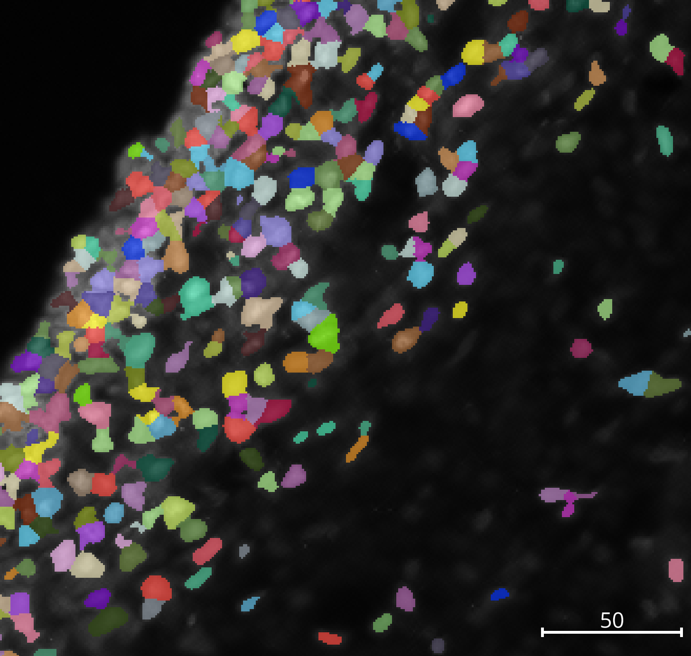
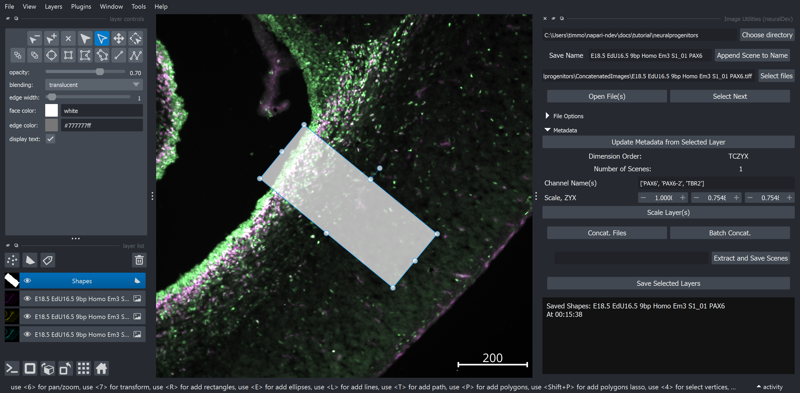
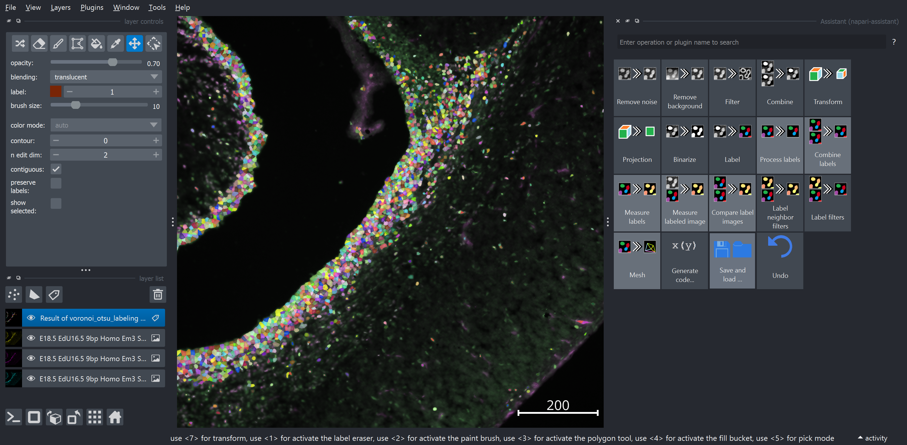

# Build your own Workflow

The goal of this tutorial is to get a user familiar with generating ROI annotations and building your own workflows. Unlike the [Example Pipeline Tutorial](01_example_pipeline.md), this tutorial just provides raw images and hints on how to progress.

For this workflow, we will be using the `neuralprogenitors` images. Our goal is to segment the PAX6 and TBR2 channels. We also specifically want to make an ROI that is 200 microns wide on each image, and bin a specific region of the brand (the specifics beyond the scope and necessity of this tutorial). Later, we will use these labels to count only the ones inside the region of interest.

The skills practiced in this tutorial will be used on relatively small, 2D images; however, things are intended to generally transfer to both 3D and higher dimensional datasets.

{ width=50% }

## Annotating regions of interest with Image Utilities

1. Load in one of the neural progenitor images from `ConcatenatedImages`
2. Navigate in the toolbar to `View` -> `Scale Bar` -> `Scale Bar Visible`. Now there should be a scale bar in the bottom right
3. Add a Shapes layer by clicking the `polygon` icon (the second button above the layer list)
4. Click the `Rectangle` button in the `layer controls`.
5. Click and drag on the image to draw a rectangle that has a 200um width.
6. Select button number 5 (highlighted in blue in the screenshot) to select the shape.
7. Move the shape by dragging
8. Rotate the shape into an area of interest.
9. Finally, with the `Shapes` layer highlighted. Click the `Save Selected Layers` button in the `Image Utilities Widget`

## Using the napari-assistant to generate a workflow

1. Open the `napari-assistant` by navigating in the toolbar to `Plugins` -> `Assistant (napari-assistant)`
2. Select the image you want to process.
3. Play around with the assistant buttons that seem interesting. Play around! They are sort of logically ordered left to right, top to bottom. The label layer I have in the image is *not* quality segmentation. Check the goal image above.
4. You can modify parameters and functions on the fly, including in previously used functions by clicking on that specific layer.
5. If you need help reaching the goal (of quality segmentation of the nuclei), try out some of the hints.
6. When you are satisfied with what the workflow. Click the `Save and load ...` button -> `Export workflow to file` and save the .yaml file produced.

### Hints

??? tip "How to label"

    You may find the functions in the `Label` button to be quite useful.

??? tip "A very useful label function"

    Check out the [voronoi_otsu_labeling](https://haesleinhuepf.github.io/BioImageAnalysisNotebooks/20_image_segmentation/11_voronoi_otsu_labeling.html) function. Read the link for more info.

??? tip "Pre-processing the images to reduce background"

    Try playing with functions in `remove noise` and `remove background` to remove some of the variability in background intensity and off-target fluorescence prior to labeling. This will make labeling more consister.

??? tip "Cleaning up the labels"

    Perhaps you have criteria for what labels you want to keep. Check out `Process Labels` button for cleaning up things like small or large labels, or labels on the edges.

??? tip "OK, I give up, just give me the answer"

    Something like the following should work well.

    1. median_sphere (pyclesperanto) with radii of 1
    2. top_hat_sphere (pyclesperanto) with radii of 10 (roughly the diameter of the objects)
    3. voronoi_otsu_label (pyclesperanto) with spot and outline sigmas of 1
    4. exclude_small_labels (pyclesperanto) that are smaller than 10 pixels

## Applying your workflow in batch with the Workflow Widget

Consider the instructions for [Using the Workflow Widget for Batch Processing](01_example_pipeline.md#using-the-workflow-widget-for-batch-processing) and apply it to this workflow.

## Measuring your batch workflow output

In additional to how we already learned how to use the `Measure Widget`, we can also consider additional creative possibility. In this case, we want to only count cells in our region of interest (the shape rectangle that was drawn), so we want to load this in as a `Region Directory`. Then, we want to ensure that the `Shape` is added as an `Intensity Image` and that we measure the `intensity_max` or `intensity_min`. The maximum intensity of an object *if it touches the region of interest at any point* will be 1. The minimum intensity of an object *fully* inside the ROI will be 1, since *all* pixels are inside the ROI. So, you can choose how you want to consider objects relative to the ROI.

Then, when grouping the data, use the `intensity_max/min_Shape` as a grouping variable! Then, all labels with a value of 1 or 0 will be counted separately. This can be extended to multiple regions of interest, because each shape has it's own value (not immediately obvious yet in napari). We have used this to label multiple brain regions consistently in whole brain section analyses.

**Future addition:** The ability to simply filter objects in the Measure Widget. This can for example be used to exclude all labels that are outside the region of interest (having a intensity value of 0 relative to the ROI), isntead of having to group.

## Notes on multi-dimensional data

Overall, most of the plugin should be able to handle datasets that have time, multi-channel, and 3D data. Try exploring the `Lund Timelapse (100MB)` sample data from `Pyclesperanto` in napari.
